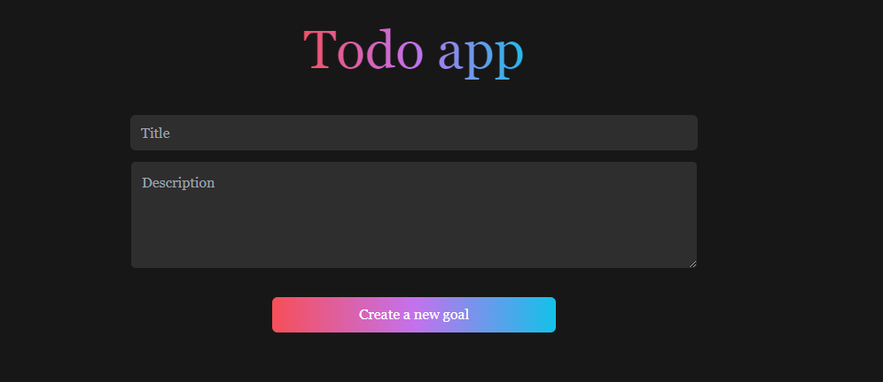
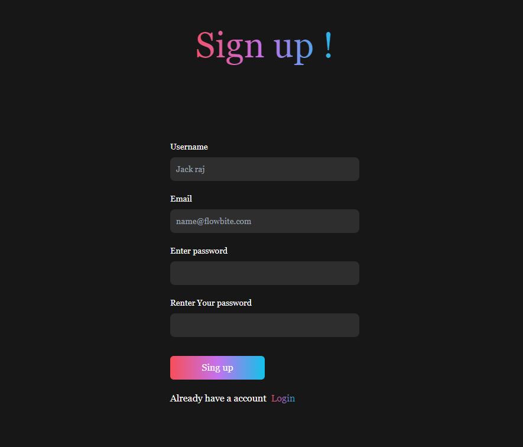
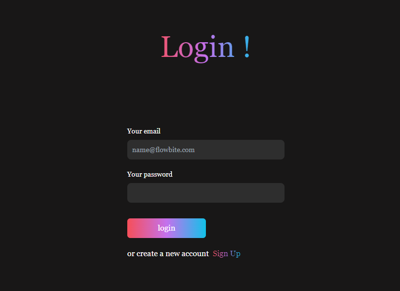
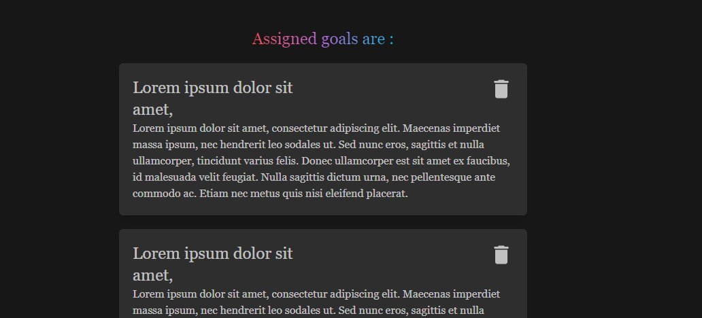

# MERN Stack Todo Application

This is a Todo application built using the MERN stack (MongoDB, Express.js, React, and Node.js). The application features JWT for authentication and Redux for state management.

## Features

- User authentication using JWT
- State management using Redux
- Create, read, update, and delete todos
- Responsive design

## Technologies Used

- **Frontend**: React, Redux
- **Backend**: Node.js, Express.js
- **Database**: MongoDB
- **Authentication**: JWT (JSON Web Tokens)

## Installation

1. Clone the repository:

   ```sh
   git clone https://github.com/hrithikrajj/todo_react.git
   cd todo_react
   ```

2. Install dependencies for the backend:

   ```sh
   cd backend
   npm install
   ```

3. Install dependencies for the frontend:

   ```sh
   cd ../frontend
   npm install
   ```

4. Create a `.env` file in the `backend` folder and add your MongoDB connection string and JWT secret:

   ```env
   MONGO_URI=your_mongo_db_connection_string
   JWT_SECRET=your_jwt_secret
   ```

5. Start the backend server:

   ```sh
   cd backend
   npm start
   ```

6. Start the frontend development server:

   ```sh
   cd ../frontend
   npm start
   ```

## Usage

1. Open your browser and navigate to `http://localhost:3000`.
2. Register a new user or log in with existing credentials.
3. Start managing your todos!

## Screenshots

### Home Page



### Todo List



### Add Todo



### Authentication



## Contributing

Contributions are welcome! Please feel free to submit a Pull Request.

## License

This project is licensed under the MIT License.
